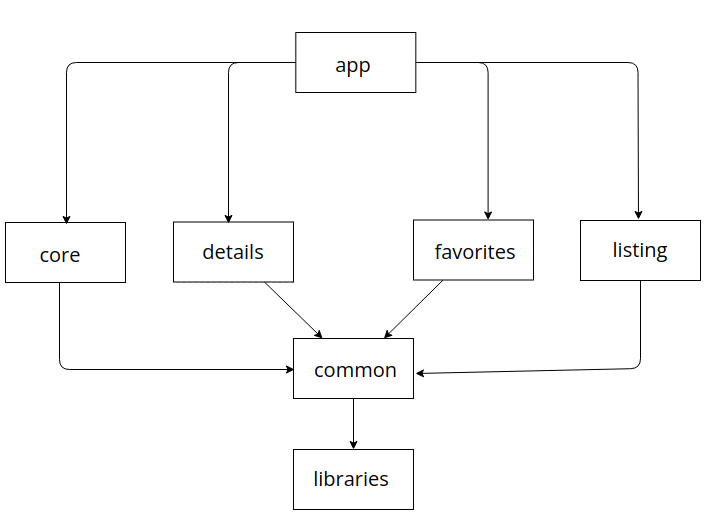

|                          Home                           |                         Details                     |                Favorites                 |
| :----------------------------------------------------:  | :-------------------------------------------------: |:---------------------------------------: |
| | | |

## Features
* Kotlin Coroutines with Flow
* Clean Architecture with MVVM
* Android Architecture Components
* Multi-module architecture
* Dagger Hilt
* Kotlin Gradle DSL

## Libraries

* [Navigation Component](https://developer.android.com/guide/navigation/navigation-getting-started)
* [Paging 3](https://developer.android.com/topic/libraries/architecture/paging/v3-overview)
* [LiveData](https://developer.android.com/jetpack/androidx/releases/lifecycle)
* [Dagger Hilt](https://dagger.dev/hilt/)
* [Retrofit](https://square.github.io/retrofit/)
* [Coroutines](https://github.com/Kotlin/kotlinx.coroutines)
* [Room](https://developer.android.com/training/data-storage/room)
* [Jetpack Datastore](https://developer.android.com/topic/libraries/architecture/datastore)
* [Timber](https://github.com/JakeWharton/timber)
* [Glide](https://github.com/bumptech/glide)
* DataBinding

## Project Structure

* :app - application module that depends on all other modules. This module contains MainActivity and CustomApplication class.
* :common - contains some common components like resources, views, base classes and only depends on domain module.
* :core - contains di modules. 
* :libraries:domain - contains domain models, repository interfaces.
* :libraries:remote - contains components related to the network.
* :libraries:database - contains components related to the database.
* :libraries:data - contains implementations of repo classes and other stuff related to data. 
* :listing - contains components related to the home screen of the app.
* :details - contains components related to the details screen of the app.
* :favorites - contains components related to the favorites screen of the app.

## API

### arabam.com SandBox API ###

* Web Postman -> https://www.postman.com/yusufcakmak/workspace/arabam-assigment/overview
* Postman Collection -> https://www.getpostman.com/collections/d0c83044d06639384b1b
* Swagger -> http://sandbox.arabamd.com/swagger/index.html

