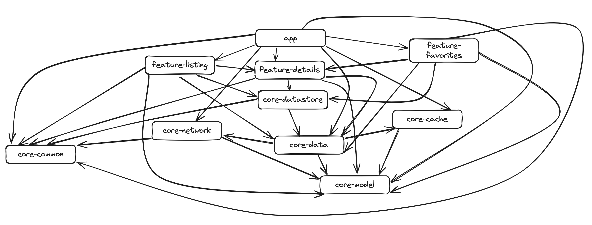

<a href="https://play.google.com/store/apps/details?id=com.dogan.arabam&hl=tr">

|                                                             Home                                                             |                              Details                               |       
|:----------------------------------------------------------------------------------------------------------------------------:|:------------------------------------------------------------------:|
|   |  |

|                               Favorites                                |                                                         Sort & Filter                                                         |
|:----------------------------------------------------------------------:|:-----------------------------------------------------------------------------------------------------------------------------:|  
|  |   |

|                      Advert Images                      |      
|:-------------------------------------------------------:|
 |  |

## Features
* Kotlin Coroutines & Flow
* Android Architecture Components
* Multi-module
* XML & Compose
* Kotlin DSL

## Libraries

* [Jetpack Compose](https://developer.android.com/develop/ui/compose/setup)
* [Navigation Component](https://developer.android.com/guide/navigation/navigation-getting-started)
* [Paging 3](https://developer.android.com/topic/libraries/architecture/paging/v3-overview)
* [LiveData](https://developer.android.com/jetpack/androidx/releases/lifecycle)
* [Dagger Hilt](https://dagger.dev/hilt/)
* [Retrofit](https://square.github.io/retrofit/)
* [Coroutines](https://github.com/Kotlin/kotlinx.coroutines)
* [Room](https://developer.android.com/training/data-storage/room)
* [Jetpack Datastore](https://developer.android.com/topic/libraries/architecture/datastore)
* [Timber](https://github.com/JakeWharton/timber)
* [Glide](https://github.com/bumptech/glide)
* [Coil](https://coil-kt.github.io/coil/)

## Module Structure

## API

### arabam.com SandBox API ###

* Web Postman -> https://www.postman.com/yusufcakmak/workspace/arabam-assigment/overview
* Postman Collection -> https://www.getpostman.com/collections/d0c83044d06639384b1b
* Swagger -> http://sandbox.arabamd.com/swagger/index.html