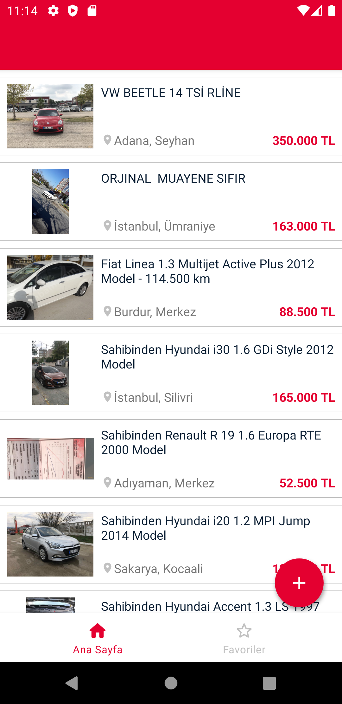
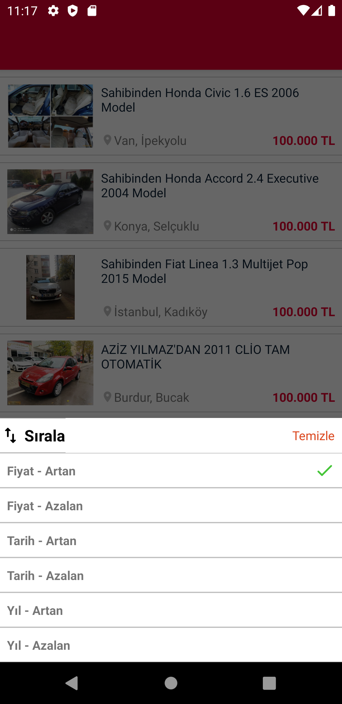
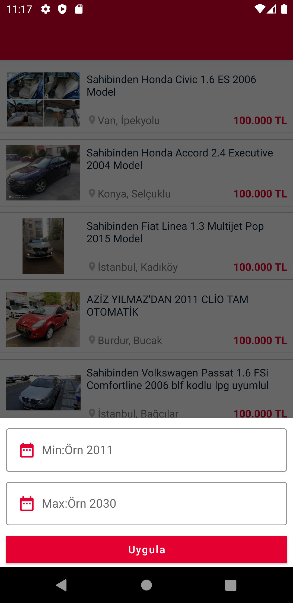
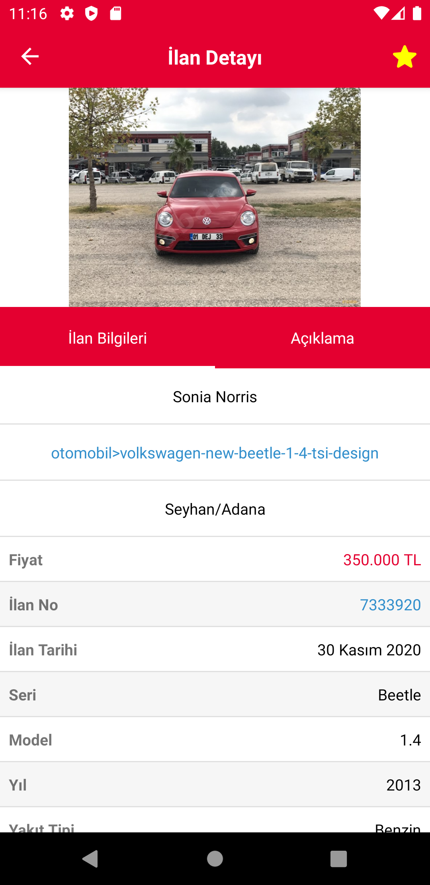
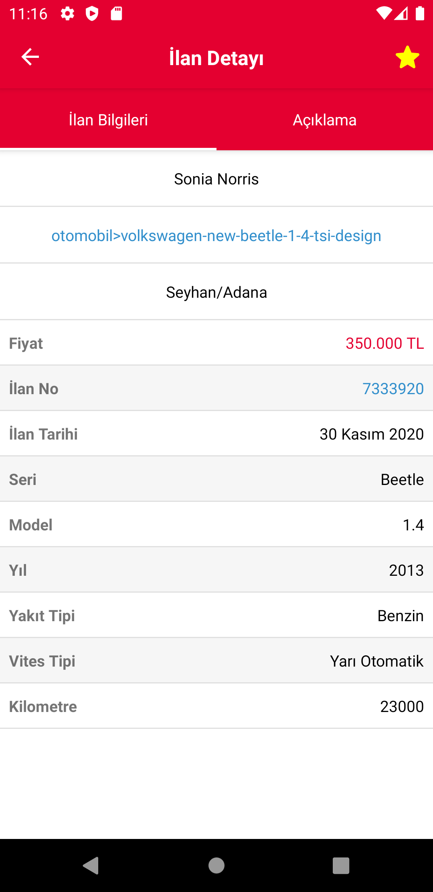
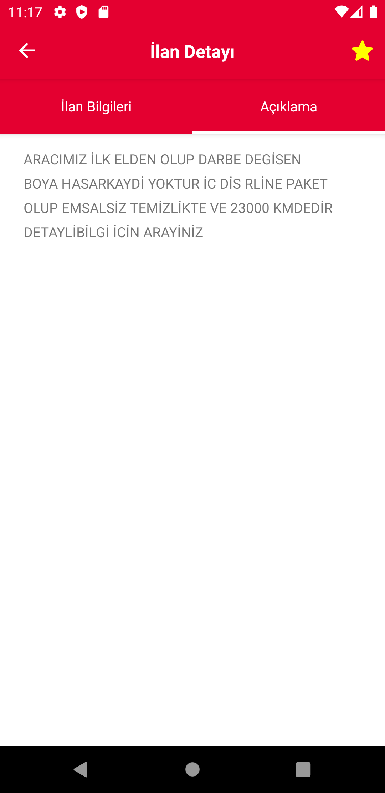
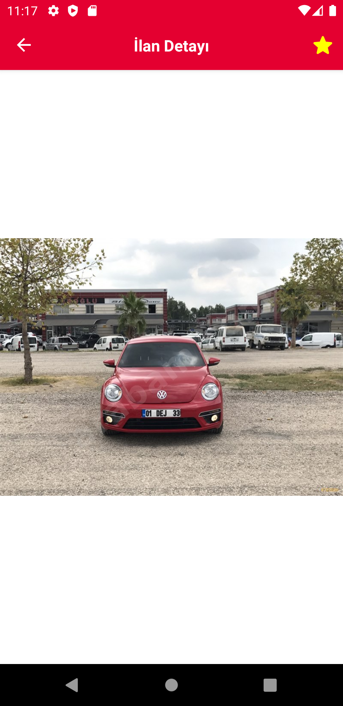
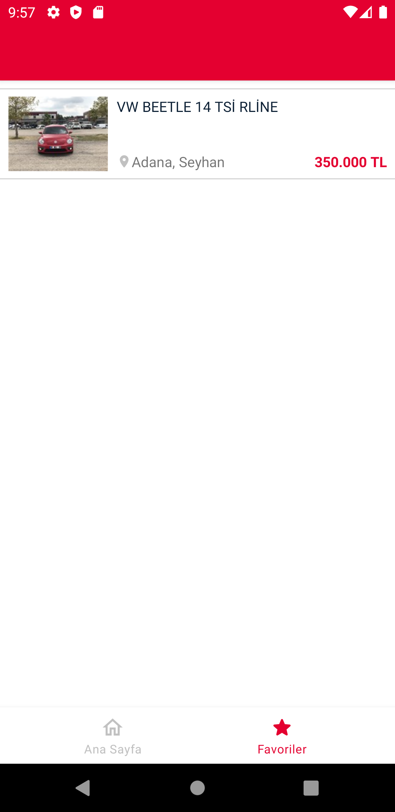

## Screenshots

   
  
  

## Libraries 

* Navigation Component
* ViewModel
* Paging
* LiveData
* DataBinding
* Dagger Hilt
* Retrofit
* Flow 
* Room

## API

### arabam.com SandBox API ###

* Web Postman -> https://www.postman.com/yusufcakmak/workspace/arabam-assigment/overview
* Postman Collection -> https://www.getpostman.com/collections/d0c83044d06639384b1b
* Swagger -> http://sandbox.arabamd.com/swagger/index.html

